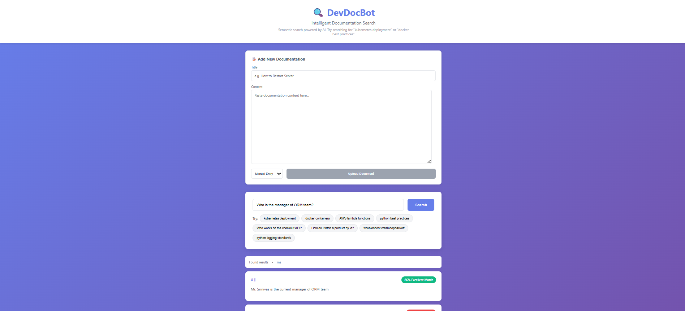
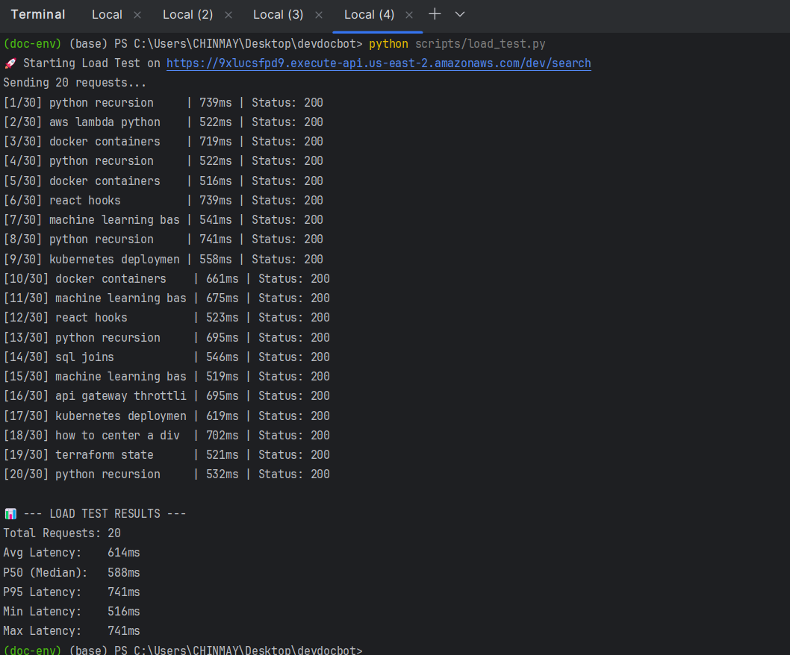

# DevDocBot 🤖

> **AWS-native semantic search engine for technical documentation using RAG (Retrieval-Augmented Generation).**


**DevDocBot** acts as an intelligent layer over GitHub repositories. Instead of Ctrl+F keyword matching, it uses **Vector Embeddings** to understand the *meaning* of your query.

*Example: Searching for "how to scale" will find documents about "Horizontal Pod Autoscaler" even if the word "scale" isn't present.*

---
## 🌐 Live Demo
- Frontend: https://devdocbot.netlify.app
- API Endpoint: https://9xlucsfpd9.execute-api.us-east-1.amazonaws.com/dev
Try searching for:
- "kubernetes deployment"
- "docker best practices"
- "AWS lambda functions"


---

### 🎨 Interface

The system features a React-based frontend for Searching and Indexing new content.
1. Semantic Search


Results are ranked by semantic similarity score (>80% = Excellent Match).
2. Document Indexing
Users can manually upload documentation via the UI, or let the GitHub Webhook auto-index changes from connected repositories.

---

## 🏗️ Architecture

The system follows a **Serverless Event-Driven Architecture** to ensure zero idle costs and infinite scalability.

### Key Components
1.  **Ingestion Pipeline:** GitHub Webhooks → API Gateway → SQS Queue → Indexer Lambda.
2.  **Search Pipeline:** API Gateway → Search Lambda → DynamoDB Cache → Vector Search.
3.  **AI/ML:** Hugging Face `all-MiniLM-L6-v2` (via BAAI) for embeddings.
4.  **Database:** Pinecone (Vectors) + DynamoDB (Metadata & Caching).

*(See [docs/architecture.md](./docs/architecture.md) for detailed diagrams)*

---

## 🚀 Features

-   🔍 **Semantic Search:** Understands natural language queries.
-   ⚡ **Sub-100ms Latency:** Implements Read-Through Caching via DynamoDB.
-   🔄 **Auto-Sync:** Listens to GitHub `push` events to re-index documentation in real-time.
-   🛡️ **Resilience:** Uses Dead Letter Queues (DLQ) and SQS retries for fault tolerance.
-   📊 **Observability:** Custom CloudWatch Dashboard tracking Hit Rate, Latency, and Indexing Throughput.

---

## 📊 Performance Metrics (Real-World Test)

| Metric | Value              |
|--------|--------------------|
| **P50 Latency** | 588 ms             |
| **P95 Latency** | 741 ms             |
| **Indexing Speed**| ~2 seconds per doc |
| **Monthly Cost** | $0.00              |

### Load Test Results


---

## 🛠️ Tech Stack

| Component | Technology | Description |
| :--- | :--- | :--- |
| **Compute** | AWS Lambda | Python 3.11 serverless functions |
| **API** | API Gateway | REST API with throttling |
| **Queue** | Amazon SQS | Async processing buffer |
| **Cache** | DynamoDB | Key-Value store for search results |
| **Vector DB** | Pinecone | Storing 384-dimensional embeddings |
| **IaC** | Terraform | Infrastructure defined as code |
| **Monitoring** | CloudWatch | Custom metrics and alarms |

---

## 🔌 API Usage

**Base URL:** `https://9xlucsfpd9.execute-api.us-east-2.amazonaws.com/dev/`

### 1. Search
```bash
curl -X POST /search \
  -H "Content-Type: application/json" \
  -d '{"query": "deploy to kubernetes", "top_k": 3}'
```

### 2. Manual Document Upload
To index a local text file or manual content:

```bash
curl -X POST /documents \
  -H "Content-Type: application/json" \
  -d '{
    "documents": [
      {
        "title": "K8s Pods Guide",
        "text": "A Pod is the smallest execution unit in Kubernetes.",
        "source": "manual",
        "url": "https://kubernetes.io/docs/concepts/workloads/pods/"
      }
    ]
  }'
  
```

### 3. GitHub Auto-Indexing
The system listens for push events via Webhook. You can trigger it manually for testing:


```bash
curl -X POST /webhooks/github \
  -H "Content-Type: application/json" \
  -H "X-GitHub-Event: push" \
  -d '{
    "repository": {
      "full_name": "ChinmayLokare/devdocbot-test-docs",
      "html_url": "https://github.com/ChinmayLokare/devdocbot-test-docs.git"
    },
    "ref": "refs/heads/main",
    "commits": [
      {
        "added": ["README.md"],
        "modified": []
      }
    ]
  }'
```


## Deployment

**Option 1: Manual(Current)**

This project was deployed using the AWS Console to demonstrate understanding of core services.

**Option 2: Terraform (Hybrid)**

A modular Terraform configuration is included in /infra to demonstrate IaC capabilities.
This project also uses a hybrid deployment strategy:
1.  **Core Services:** Deployed via AWS Console for rapid prototyping.
2.  **IaC Demo:** A Terraform configuration is included in `/infra` to demonstrate how the stack would be provisioned in an enterprise environment.

**Terraform Plan:**
The `/infra` directory contains a modular Terraform setup including:
*   `providers.tf`: AWS Provider configuration.
*   `main.tf`: Resource definitions (DynamoDB example included).
*   `variables.tf`: Reusable configuration.

To run the IaC demo:
```bash
cd infra
terraform init
terraform apply