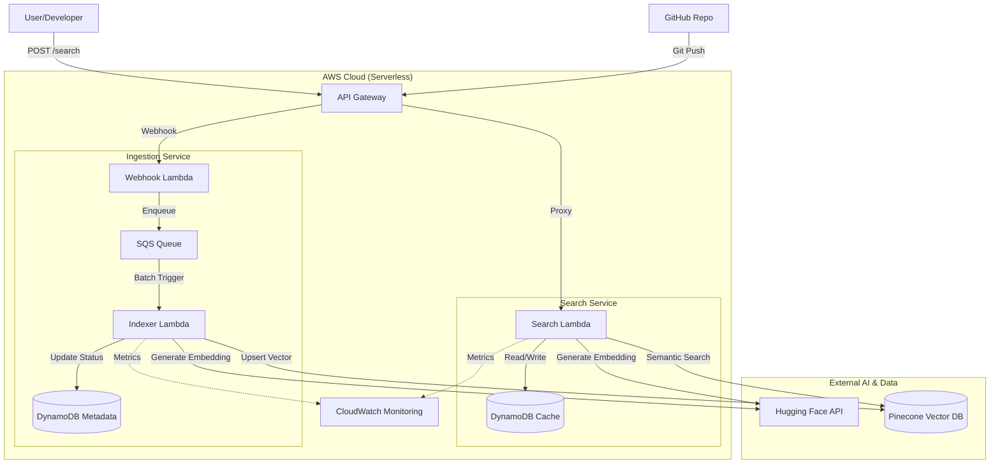
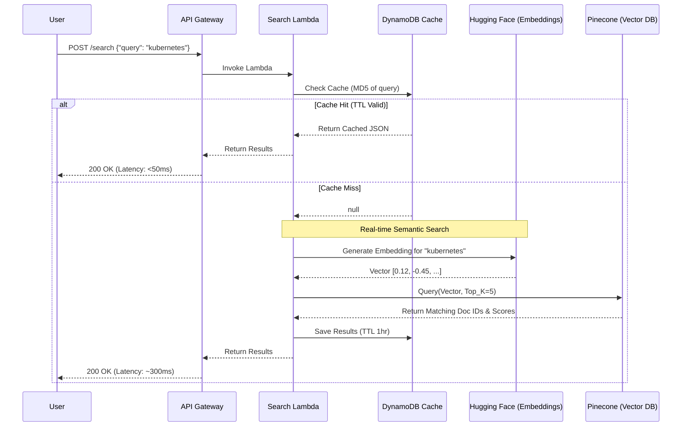

# System Architecture

This document outlines the high-level infrastructure and data flow for **DevDocBot**.

---

## 1. High-Level Infrastructure
This flowchart illustrates the component relationship and boundaries between AWS, External AI services, and Users.

## 2. Search Request Sequence
This diagram details the logic flow when a user performs a search, including the "Read-Through Caching" strategy.

